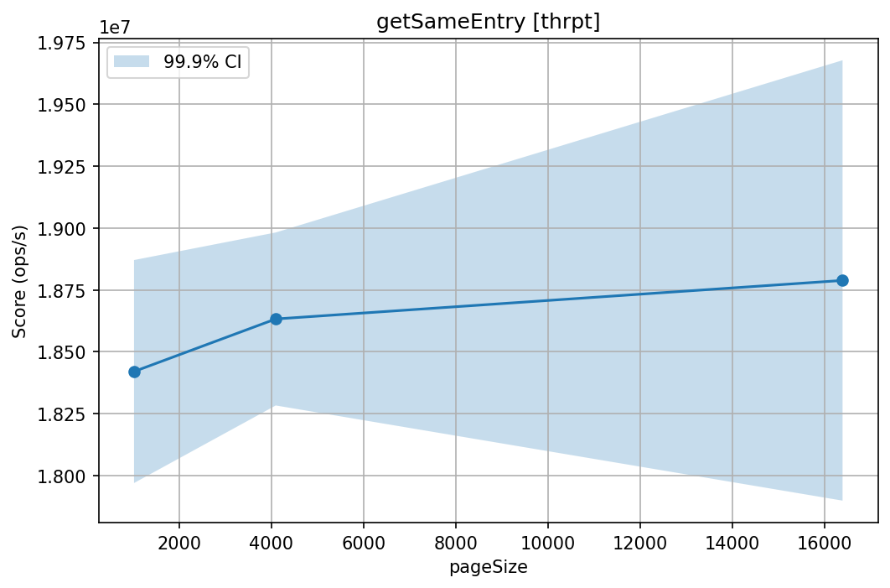
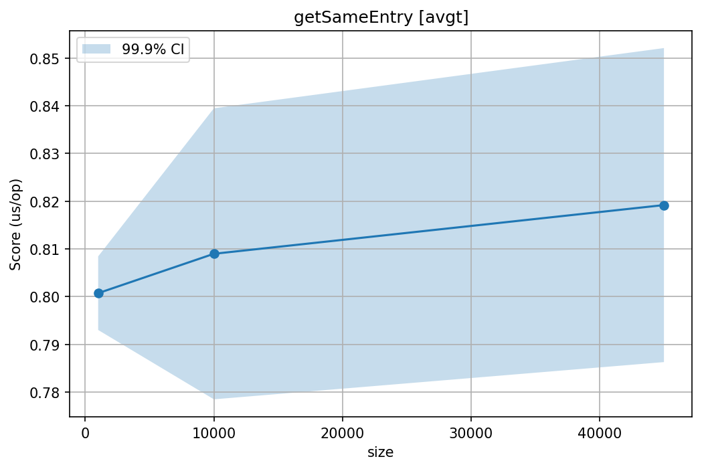
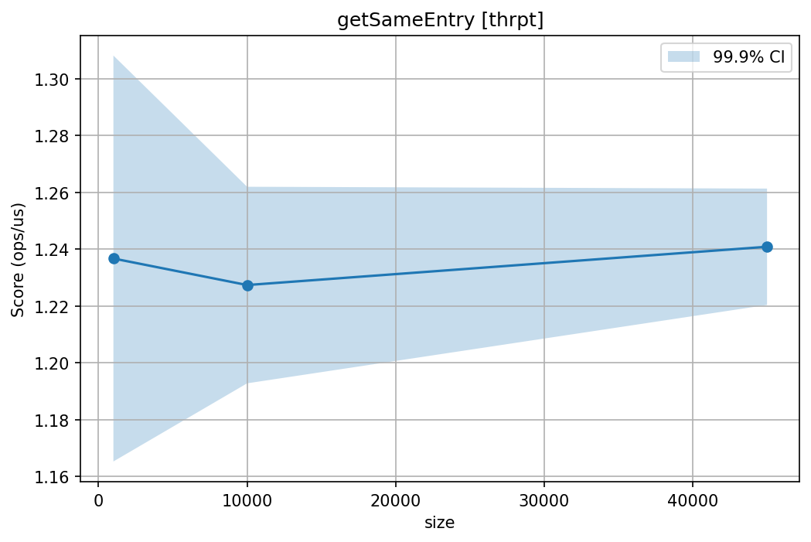

# Лабораторная работа 1

## Алгоритмы

1. **FileSystemHashTable** — extensible hashing на mmap-файлах
2. **PerfectHashTable** — двухуровневое хеширование (FKS)
3. **LSHIndex** — поиск дубликатов

## Датасеты

| Алгоритм | Файл | Ключ / Значение | Записей |
|---|---|---|---|
| FileSystemHashTable | `corpus_train.csv` | title / abstract | 17 189 |
| PerfectHashTable | `corpus_train.csv` | title / abstract | 16 420 |
| LSHIndex | `claims_train.csv` + `claims_test.csv` или `corpus_train.csv` | claim / title+abstract | 1 261 + 300 или 17 189 |

JDK 17 (ARM64), JMH 1.37, fork=1, warmup 3×2s, measurement 5×3s, `-prof gc`. macOS Apple Silicon.

---

## 1. FileSystemHashTable (Extensible Hashing)

- Directory из 2^d указателей на бакеты, каждый бакет — mmap-файл.
- При переполнении бакета (> pageSize) — split: записи перераспределяются по следующему биту хеша, directory удваивается при необходимости.
- Метаданные в `meta.dat`, записи в формате `[keyLen:4][key][valLen:4][val][flag:1]`.
- Удаление — один байт-флаг.

### Throughput (ops/s)

| Операция | 1 KB page | 4 KB page | 16 KB page | B/op |
|---|---:|---:|---:|---:|
| put | 7 521 | 37 041 | 138 746 | 14K–318K |
| getExisting | 8 381 892 | 5 640 341 | 3 177 787 | 346–361 |
| getSameEntry | 18 415 585 | 18 394 099 | 18 626 959 | 528–560 |
| getMissing | 10 870 785 | 4 856 382 | 2 605 533 | 104–117 |
| updateExisting | 6 852 872 | 4 312 820 | 1 503 375 | 188–221 |
| deleteAndReinsert | 221 | 806 | 3 776 | 595K–11M |

### Пакетные (SingleShot, 17 189 записей)

| Операция | 1 KB | 4 KB | 16 KB | Alloc |
|---|---:|---:|---:|---:|
| putAll | 5 283 ms | 234 ms | 70 ms | 8.7 GB / 25 MB / 14 MB |
| getAll (1 000) | 0.47 ms | 0.59 ms | 0.80 ms | ~355–391 KB |

### Графики

#### Throughput





#### SingleShot


#### Профилирование CPU (put)


Почти всё время — flush в диск (`FileChannel.write` → `UnixFileDispatcherImpl.write0`). Оптимизация: батчевание записей.

#### Профилирование Memory (put)


Аллокации при создании бакетов и split-операциях.

#### Профилирование CPU (getExisting)


Время уходит на чтение бакета через mmap и сравнение ключей.

#### Профилирование Memory (getExisting)


Аллокации — на работу с mmap-буфером.

### Анализ

- GET быстрее при мелких страницах (1 KB: 8.4M ops/s vs 16 KB: 3.2M) — меньше записей на бакет, сканирование короче.
- **getSameEntry** ~18.4M ops/s **независимо от размера страницы** — подтверждает, что разница в getExisting между 1 KB и 16 KB вызвана объёмом сканирования внутри бакета, а не алгоритмической сложностью. При обращении к одному и тому же ключу ОС кеширует страницу и сканирование минимально.
- PUT наоборот: при 1 KB — частые splits (перечитывание + перераспределение записей), поэтому 7.5K ops/s; при 16 KB splits редки — 139K ops/s.
- putAll при 1 KB — 5.3 секунды и 8.7 GB аллокаций (массовые splits), при 16 KB — 70 ms.
- deleteAndReinsert медленный из-за того, что delete помечает tombstone, а reinsert дописывает новую запись → бакет растёт → split.

### Оптимизации

- Компактификация перед split — убирать tombstones
- Merge бакетов при большом количестве удалений
- Bloom filter перед сканированием

---

## 2. PerfectHashTable

Primary hash → m=n бакетов, для бакета с k коллизиями — вторичная таблица k² с бесколлизионной хеш-функцией.

### Lookup (us/op)

| Операция | 1K | 10K | 45K | B/op |
|---|---:|---:|---:|---:|
| getExisting | 0.444 | 0.457 | 0.472 | ≈ 0 |
| getSameEntry | 0.801 | 0.817 | 0.815 | ≈ 0 |
| getMissing | 0.228 | 0.238 | 0.245 | 56 |

GC = 0 на getExisting и getSameEntry. getMissing 56 B/op — от генерации случайного ключа в бенчмарке.

### Build (SingleShot)

| Размер | Время |
|---:|---:|
| 1K | 1.01 ms |
| 10K | 6.65 ms |
| 45K | 11.85 ms |

### Графики

#### Lookup (avgt)





#### Lookup (thrpt)





#### Build (SingleShot)


#### Профилирование CPU (getExisting)


Всё CPU уходит на вычисление хеша (`polyHash`, `Math.floorMod`) — на primary и secondary уровнях. Не улучшить без смены хеш-функции.

#### Профилирование Memory (getExisting)

Flame graph пуст — async-profiler не зафиксировал ни одной аллокации (подтверждается `-prof gc`: 0 B/op). Lookup полностью безаллокационный: два вычисления хеша + два обращения к массиву.

#### Профилирование CPU (buildIndex)


Время — на генерацию хеш-функций и вычисление хешей.

#### Профилирование Memory (buildIndex)


Аллокации — на вторичные таблицы и внутренние ArrayList.

### Анализ

- Lookup ~0.45 us независимо от размера — O(1).
- **getSameEntry** ~0.81 us/op, стабильно при любом размере таблицы. getExisting показывает лёгкий рост (0.444 → 0.472) при увеличении таблицы от 1K до 45K, а getSameEntry остаётся плоским — это подтверждает влияние cache locality: при случайном доступе к большей таблице кеш работает хуже.
- getMissing в ~1.9x быстрее: промах виден на первом уровне.
- Build линейный.

### Оптимизации

- MurmurHash3 вместо polynomial — быстрее на 30–50%
- Primitive arrays вместо Object[][]

---

## 3. LSHIndex

Текст → k-граммы (k=3) → MinHash int[100] (20 bands × 5 rows) → banding.

Используются два датасета: **claims** (1 261 train + 300 test) и **corpus** (17 189 документов, title+abstract). 

### Throughput (us/op)

| dataset | addDocument | queryCandidates | querySimilar |
|---|---:|---:|---:|
| claims | 14.9 (7.5K B/op) | 14.0 (7.0K B/op) | 14.1 (7.1K B/op) |
| corpus | 25.7 (11.4K B/op) | 24.1 (11.0K B/op) | 24.5 (11.1K B/op) |

### SingleShot

| dataset | buildIndex | findAllDuplicates (LSH) | findAllDuplicatesBruteForce |
|---|---:|---:|----------------------------:|
| claims (1 261 docs) | 19.5 ms (11.2 MB) | 2.1 ms (0.8 MB) |                    731.0 ms |
| corpus (17 189 docs) | 406.2 ms (234 MB) | 13.8 ms (0.8 MB) |                     > 2 min |

Brute-force на claims: 18 GC сборок. LSH: GC ≈ 0. На corpus время и аллокации растут с N.

### Качество (claims, 1 261 документов, порог Jaccard ≥ 0.5)

| | LSH | Brute-force |
|---|---:|---:|
| Пар найдено | 1 640 | 1 720 |
| Время | 2.1 ms | 731 ms |

**Recall** 95.06% — **Precision** 99.70%

### Графики

#### Throughput (avgt)


#### SingleShot


#### Профилирование CPU (addDocument)


Время — на shingling (вычисление k-грамм) и MinHash сигнатуру (100 хеш-функций).

#### Профилирование Memory (addDocument)


Аллокации ~7.5K B/op — создание шинглов и сигнатуры.

#### Профилирование CPU (buildIndex)


Линейный build: N вызовов add, каждый O(1).

#### Профилирование Memory (buildIndex)


Аллокации растут линейно с N — на шинглы, сигнатуры и band-таблицы.

### Анализ

- B/op ~7.5K на add (claims) и ~11.4K (corpus) — shingling + сигнатура.
- Brute-force 1.3 GB на claims. На corpus оценка > 2 минут (N² сравнений).
- LSH на corpus (17k docs) ищет дубликаты за ~14 ms.

### Оптимизации

- Rolling hash для shingling — ~2x на add
- One-pass MinHash — -50% памяти
- Primitive hash maps для band-таблиц — -30% GC

---

## Сборка и запуск

```bash
mvn clean package -DskipTests
mvn test

java -Xmx1g -Ddataset.dir=. -jar target/lab-1-1.0-SNAPSHOT.jar FileSystemHashTableBenchmark -prof gc
java -Xmx1g -Ddataset.dir=. -jar target/lab-1-1.0-SNAPSHOT.jar PerfectHashTableBenchmark -prof gc
java -Xmx2g -Ddataset.dir=. -jar target/lab-1-1.0-SNAPSHOT.jar LSHIndexBenchmark -prof gc
# только claims: -p dataset=claims
# только corpus: -p dataset=corpus  (-Xmx4g для findAllDuplicatesBruteForce)
```
