# Лабораторная работа 2

## Алгоритм

**KD-дерево (k-dimensional tree)** — пространственный индекс для геопоиска по координатам (lat/lng) в 3D (проекция на единичную сферу). 

Поддерживает вставку, поиск ближайшего соседа и поиск в радиусе.

## Датасет

| Параметр | Значение |
|---|---|
| Точки | случайные (lat ∈ [−90, 90], lng ∈ [−180, 180]), seed=42 |
| Размеры | 1 000 / 10 000 / 50 000 |
| Радиус поиска | 100 км |

---

## 1. KDTree (3D branch-and-bound)

- Каждая точка (lat, lng) → 3D на единичной сфере: `x = cos(lat)·cos(lng)`, `y = cos(lat)·sin(lng)`, `z = sin(lat)`.
- Вставка — рекурсивный спуск, ось `depth % 3`. Поиск — branch-and-bound с AABB-отсечением.
- Сравнение с **BruteForceIndex** — линейный перебор через Хаверсайна.

### findNearest (us/op, avgt)

| Dataset | KDTree | BruteForce | Ускорение | B/op (KD / BF) |
|---:|---:|---:|---:|---:|
| 1 000 | 0.288 ± 0.019 | 29.91 ± 0.12 | **104x** | 144 / ≈ 0 |
| 10 000 | 0.394 ± 0.013 | 331.8 ± 3.1 | **842x** | 144 / ≈ 1 |
| 50 000 | 0.471 ± 0.017 | 1 741 ± 32 | **3 696x** | 144 / ≈ 4 |

### findInRadius (us/op, avgt)

| Dataset | KDTree | BruteForce | Ускорение | B/op (KD / BF) |
|---:|---:|---:|---:|---:|
| 1 000 | 0.231 ± 0.008 | 30.05 ± 0.31 | **130x** | 150 / 30 |
| 10 000 | 0.448 ± 0.062 | 347.1 ± 5.7 | **775x** | 184 / 65 |
| 50 000 | 1.042 ± 0.011 | 1 634 ± 21 | **1 569x** | 275 / 158 |

### findNearest (ops/us, thrpt)

| Dataset | KDTree | BruteForce |
|---:|---:|---:|
| 1 000 | 3.391 ± 0.074 | 0.033 ± 0.001 |
| 10 000 | 2.548 ± 0.051 | 0.003 ± 0.001 |
| 50 000 | 2.153 ± 0.024 | 0.001 ± 0.001 |

### findInRadius (ops/us, thrpt)

| Dataset | KDTree | BruteForce |
|---:|---:|---:|
| 1 000 | 4.378 ± 0.089 | 0.034 ± 0.001 |
| 10 000 | 2.261 ± 0.083 | 0.003 ± 0.001 |
| 50 000 | 0.967 ± 0.016 | 0.001 ± 0.001 |

### buildIndex (SingleShot, ms)

| Dataset | KDTree | BruteForce | Alloc (KD / BF) |
|---:|---:|---:|---:|
| 1 000 | 0.138 ± 0.037 | 0.048 ± 0.019 | 79 KB / 22 KB |
| 10 000 | 1.453 ± 0.381 | 0.311 ± 0.254 | 727 KB / 176 KB |
| 50 000 | 8.694 ± 0.327 | 0.315 ± 0.281 | 3.6 MB / 861 KB |

### Графики

#### findNearest (avgt)

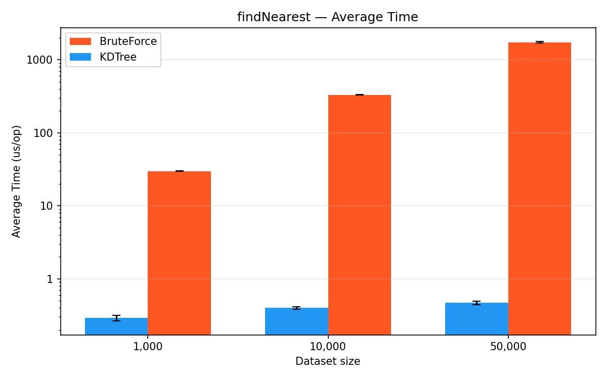

#### findNearest (thrpt)

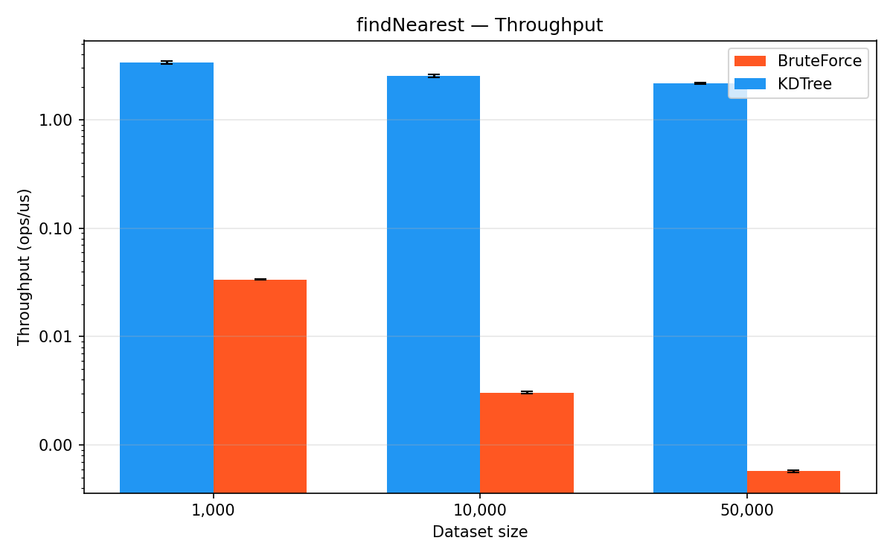

#### findInRadius (avgt)

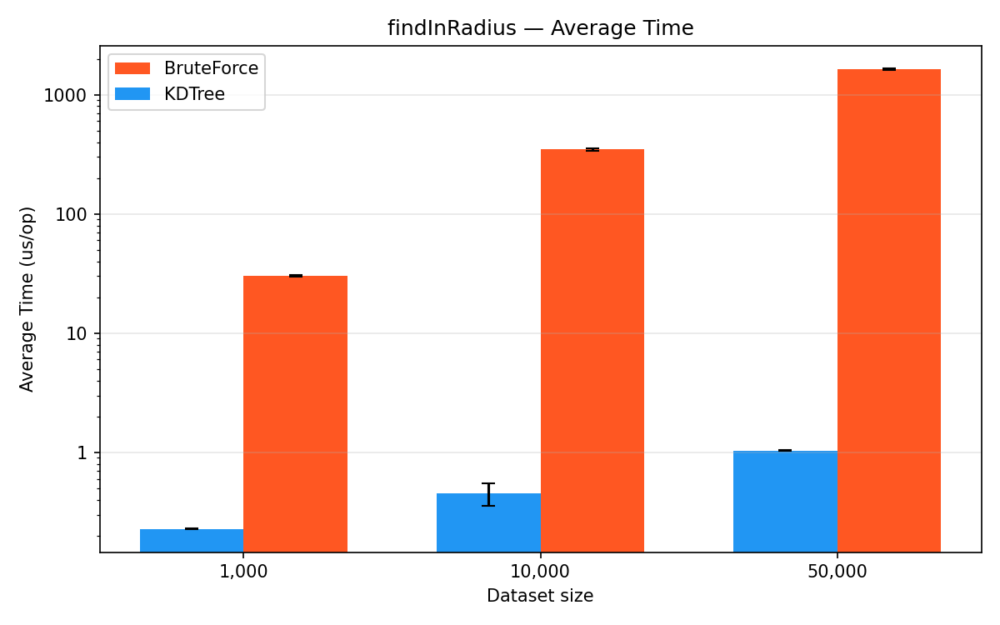

#### findInRadius (thrpt)

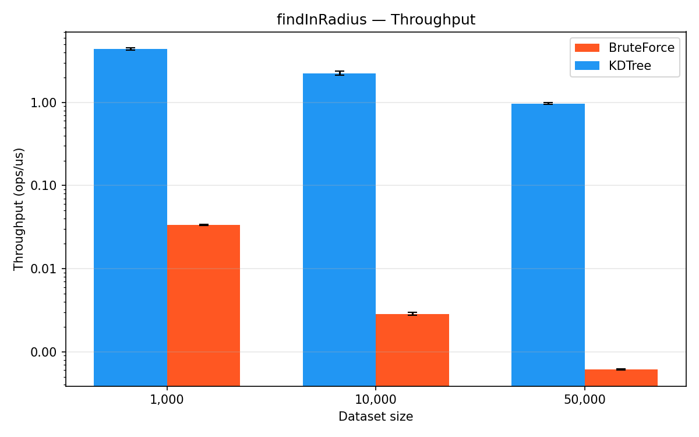

#### buildIndex (SingleShot)

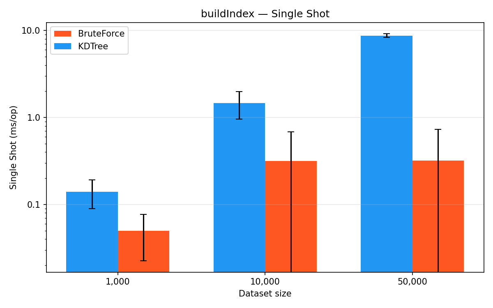

#### Профилирование CPU (findNearest, KDTree)

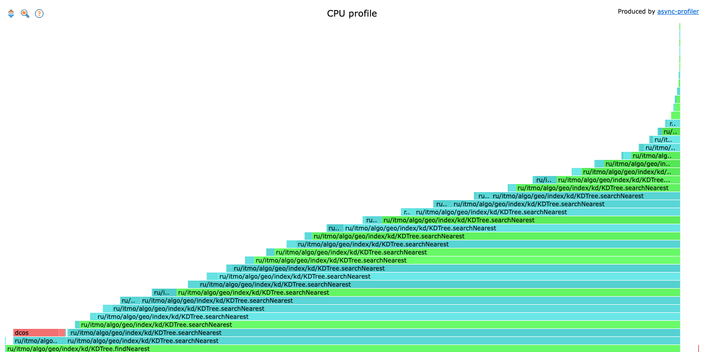

Время — на вычисление евклидова расстояния (`KDMath.euclidSq`) и минимального расстояния до AABB (`KDMath.minDistSqToBox`).

#### Профилирование Memory (findNearest, KDTree)

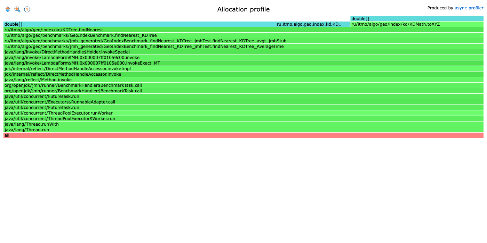

144 B/op стабильно — аллокации только на query-точку и NNState, не на обход дерева.

#### Профилирование CPU (findInRadius, KDTree)

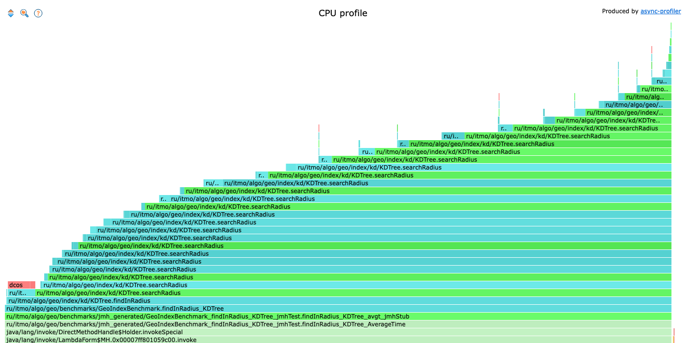

Аналогично findNearest + создание ArrayList результатов.

#### Профилирование Memory (findInRadius, KDTree)

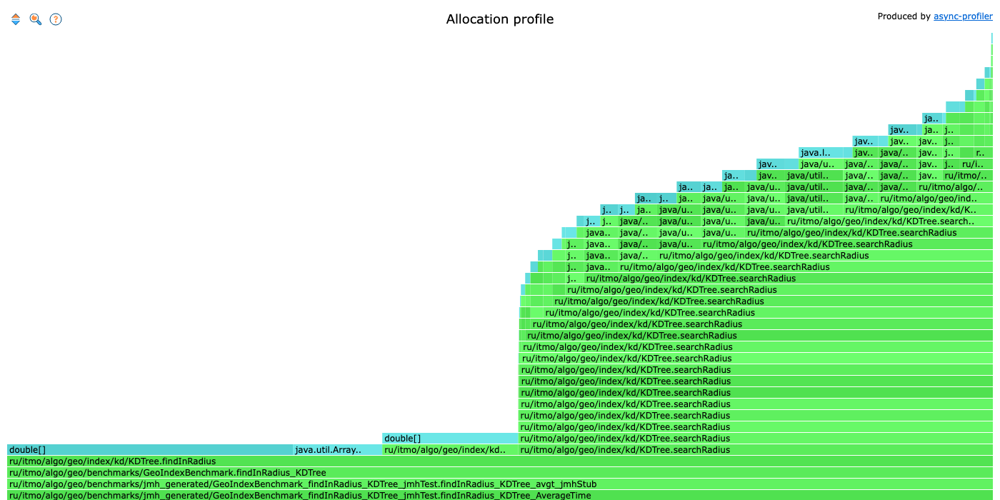

B/op растёт с N (150 → 275) — ArrayList результатов увеличивается с числом найденных точек.

#### Профилирование CPU (buildIndex, KDTree)

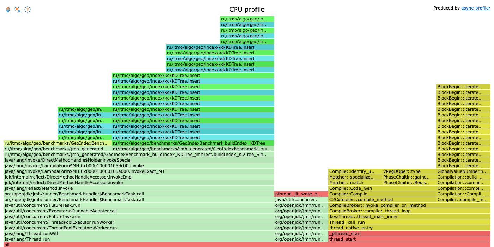

Время — на создание KDNode и вычисление `toXYZ` для каждой точки.

#### Профилирование Memory (buildIndex, KDTree)

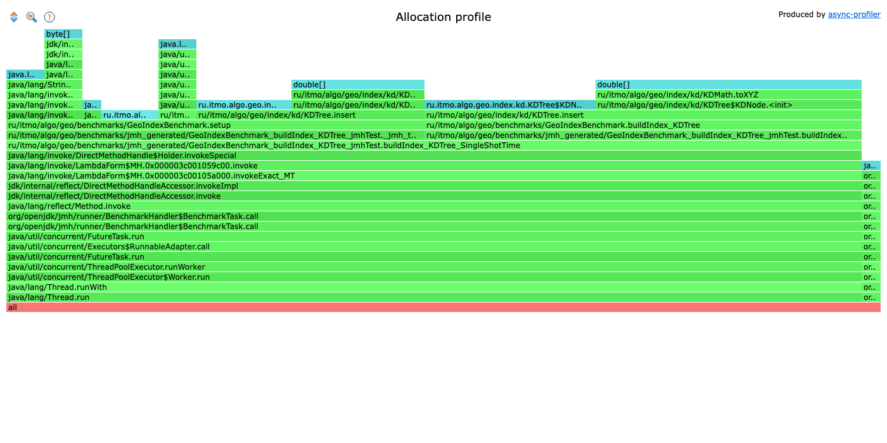

Аллокации ~4x от BruteForce — каждая вставка создаёт KDNode + double[3].

### Анализ

- **findNearest KDTree** демонстрирует субмикросекундную latence (0.29–0.47 us/op), которая **слабо растёт** с увеличением датасета (×1.6 при росте N в 50 раз). Это подтверждает O(log n) сложность. BruteForce линеен: рост ровно пропорционален N (30 → 332 → 1738 us).
- **Ускорение KDTree** растёт от **103x** (1K) до **3 722x** (50K) — чем больше данных, тем больше выигрыш дерева.
- **findInRadius KDTree** чуть быстрее findNearest при малых N (0.23 vs 0.29 us) — радиус 100 км при равномерном распределении по сфере даёт мало кандидатов, и отсечение ветвей срабатывает агрессивнее. При 50K рост до 1.04 us — больше точек попадает в радиус, растёт k.
- **B/op findNearest KDTree = 144 стабильно** — 2 массива double[3] (query xyz + AABB bounds) + объект NNState. Не зависит от N.
- **B/op BruteForce findNearest ≈ 0** — никаких аллокаций, чистый линейный скан.
- **buildIndex KDTree** дороже BruteForce (0.14 vs 0.05 ms при 1K; 8.7 vs 0.32 ms при 50K) — каждая вставка создаёт KDNode с double[3], а BruteForce просто добавляет в ArrayList.

### Оптимизации

- **Bulk-loading (median-of-medians)** — построение сбалансированного дерева за O(n log n) вместо случайной вставки, улучшит и build time, и query quality.
- **Итеративный поиск** вместо рекурсивного — уберёт overhead стекфреймов, потенциально -20–30% на findNearest.
- **Object pooling для NNState** — экономия 144 B/op (хотя JIT скорее всего уже делает scalar replacement).
- **Примитивные массивы вместо GeoObject[]** — хранить lat/lng/name отдельно для лучшей cache locality.

### Глубина рекурсии

Все операции (insert, searchNearest, searchRadius) увеличивают `depth` на 1 при каждом спуске по дереву. Ось разбиения циклически меняется: `dim = depth % 3` (X → Y → Z → X → …).

- **Сбалансированное дерево**: глубина рекурсии — `O(log n)`.
- **Вырожденное дерево** (без балансировки, как в текущей реализации): глубина — `O(n)`, что при большом N может привести к `StackOverflowError`.

В `searchNearest` / `searchRadius` глубина стека та же (высота дерева), но на каждом уровне возможен вызов обоих поддеревьев — pruning через `minDistSqToBox` отсекает заведомо далёкие ветки, не увеличивая глубину.
