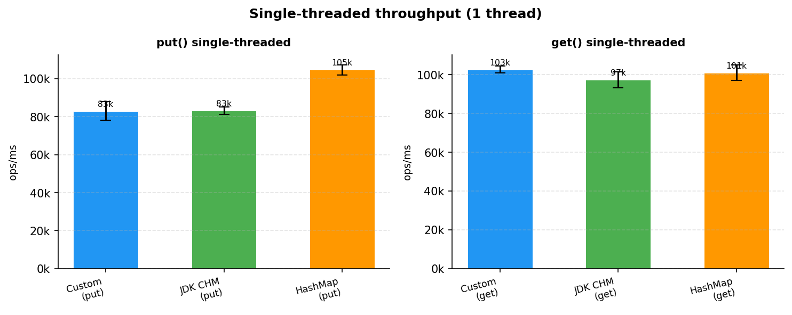
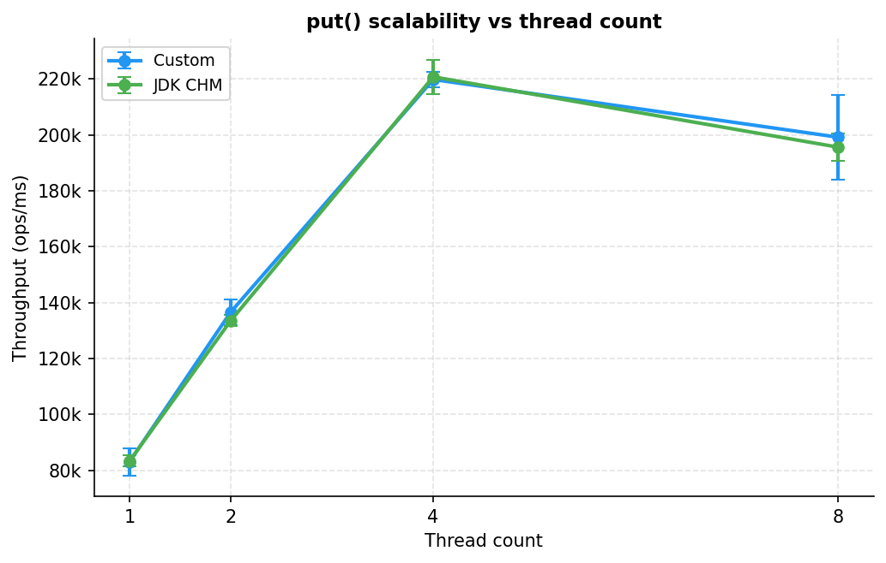
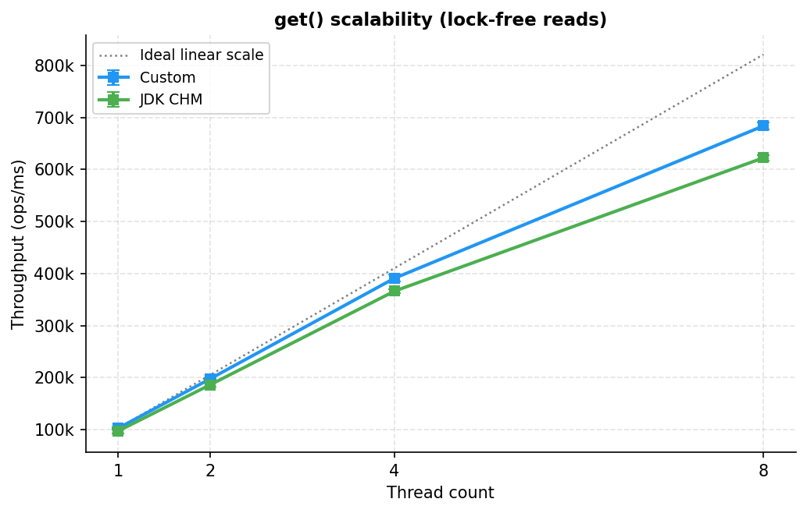
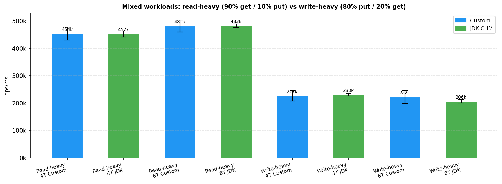
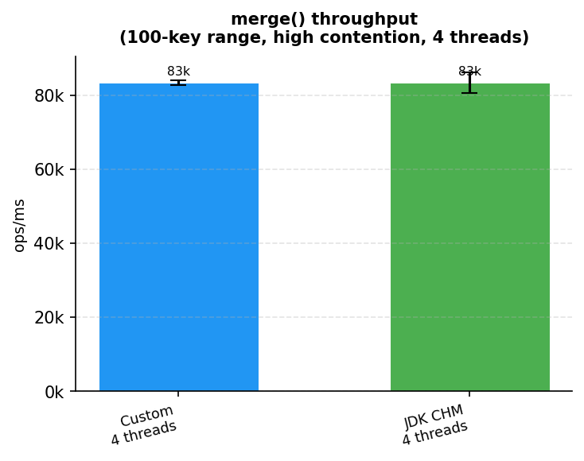
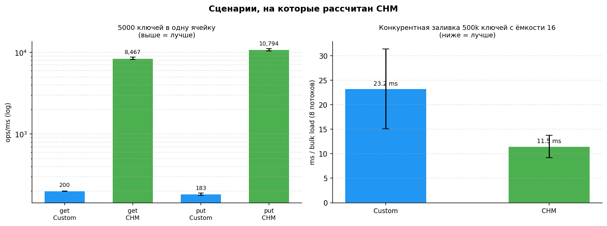

# Лабораторная работа 4

## Алгоритм

**Потокобезопасная хеш-таблица с цепочками** — устройство близко к стандартной `java.util.concurrent.ConcurrentHashMap` (далее CHM). Блокировка берётся не на всю таблицу, а на отдельную ячейку (бакет):

- вставка в пустую ячейку — атомарной операцией `compareAndSet`, без блокировки;
- запись в занятую ячейку блокирует только её; значение существующего ключа меняется на месте;
- чтение (`get`, обход) не берёт блокировок вообще;
- при заполнении таблица расширяется вдвое; во время расширения чтение и запись продолжают работать;
- размер хранится в счётчике `LongAdder`, `merge` атомарен, итератор отдаёт снимок на момент вызова.

Гарантии: чтение почти никогда не блокируется, порядок завершённых операций однозначен.

## 1. Сравнение с JDK CHM

JMH, пропускная способность (ops/ms), 3 прогона JVM.

### Однопоток

| Операция | Custom | JDK CHM | HashMap |
|---|---:|---:|---:|
| `put` | 82 976 ± 4 887 | 83 262 ± 2 003 | 104 628 |
| `get` | 102 620 ± 1 732 | 97 309 ± 4 190 | 100 987 |

### put(), масштабируемость

| Потоки | Custom | JDK CHM |
|---:|---:|---:|
| 1 | 82 976 ± 4 887 | 83 262 ± 2 003 |
| 2 | 136 597 ± 4 603 | 133 532 ± 1 915 |
| 4 | 219 810 ± 2 776 | 220 750 ± 6 129 |
| 8 | 199 155 ± 15 049 | 195 584 ± 4 780 |

### get(), масштабируемость

| Потоки | Custom | JDK CHM | Идеал |
|---:|---:|---:|---:|
| 1 | 102 620 ± 1 732 | 97 309 ± 4 190 | 102 620 |
| 2 | 197 822 ± 1 291 | 186 362 ± 4 413 | 205 240 |
| 4 | 391 147 ± 6 739 | 366 356 ± 3 781 | 410 480 |
| 8 | 683 629 ± 6 043 | 622 345 ± 5 324 | 820 960 |

### Смешанные нагрузки

| Сценарий | Потоки | Custom | JDK CHM |
|---|---:|---:|---:|
| Read-heavy (90% get) | 4 | 453 797 ± 23 559 | 452 430 ± 11 608 |
| Read-heavy (90% get) | 8 | 481 268 ± 21 542 | 482 638 ± 7 072 |
| Write-heavy (80% put) | 4 | 226 796 ± 19 525 | 230 294 ± 4 551 |
| Write-heavy (80% put) | 8 | 221 996 ± 24 314 | 206 031 ± 6 767 |

### merge (4 потока, 100 ключей)

| Custom | JDK CHM |
|---:|---:|
| 83 456 ± 714 | 83 462 ± 2 805 |

### Графики

### Анализ

- **Запись — наравне с CHM**: `put`, смешанные нагрузки и `merge` отличаются в пределах погрешности.
- **Чтение — стабильно быстрее на 6–10%**: код чтения проще, чем у CHM (меньше проверок при обходе ячейки).
- **Почему в основном наравне**: таблица заранее достаточного размера, цепочки короткие — в таких условиях обе реализации делают почти одно и то же.
- Снижение `put` с 4 к 8 потокам видно у обеих — особенность машины (12 ядер, турбо), а не алгоритма.

---

## 2. Где выигрывает JDK CHM

Два режима, которые не затрагивает п.1 — вынесены отдельно в [`StressBenchmark`](src/main/java/ru/itmo/bench/StressBenchmark.java).

### Коллизии: 5 000 ключей в одну ячейку, 1 поток (ops/ms)

| Операция | Custom | JDK CHM | |
|---|---:|---:|---|
| `get` | 200 ± 1 | 8 467 ± 296 | CHM **×42** |
| `put` | 183 ± 7 | 10 794 ± 336 | CHM **×59** |

### Расширение таблицы: 8 потоков вставляют 500 000 ключей в маленькую таблицу (мс, меньше = лучше)

| Custom | JDK CHM | |
|---:|---:|---|
| 23.2 ± 8.1 | 11.5 ± 2.3 | CHM **×2** |

### Анализ

- **Коллизии**: когда много ключей попадают в одну ячейку, CHM перестраивает её в дерево и ищет за O(log n); Custom остаётся списком и перебирает все элементы — отсюда разрыв в десятки раз. Работает, только если ключи сравнимы между собой.
- **Расширение**: CHM переносит данные сразу несколькими потоками, в Custom перенос делает один поток, а остальные ждут — отсюда вдвое дольше и большой разброс.

---

## Оптимизации

- **Дерево в длинных цепочках** — чтобы при коллизиях не перебирать весь список.
- **Параллельное расширение** — переносить данные несколькими потоками, а не одним.
