# Полнотекстовый поиск

Полнотекстовый поиск на Java: координатный обратный индекс, `AND/OR/NOT/ADJ/NEAR`,
ANTLR4-парсер запросов, mmap-хранилище индекса, несколько lossless-кодеков сжатия и BM25/WAND
ранжирование.

## Конфигурация измерений

Корпус: Wikipedia en `20231101`, `data/wikipedia.jsonl`, 3.22 GB decimal ≈ 3.0 GiB, 866 868 статей.  
- Benchmark-срез: 500 000 статей, 2 312 349 термов, 128 897 811 posting-ов, 314 927 398 токенов.  
- Замер: 3 прогрева, 10 расчетных попыток, среднее значение и 95% доверительный интервал по Student t.
- Все кодеки lossless, поэтому сжатие не меняет recall. Recall/QPS меняется только в WAND при
  увеличении `F`.

Чтобы быстрые операции не измерялись на долях миллисекунды, один расчетный раунд повторяет workload
до примерно 250 ms, а в таблицах показана latency одного исходного batch-а запросов. JVM: OpenJDK 17,
`-Xmx30g`.


## Сжатие: размер vs скорость

Профили кодеков пишутся как `docId/freq/pos`, `blockSize=128`. Для `docId` и `pos` всегда
используется delta-encoding поверх базового кодека.

### По коэффициенту сжатия

| Профиль | postings, MB | сжатие | AND qps ± 95% CI | BM25 qps ± 95% CI | ADJ qps ± 95% CI |
|---|---:|---:|---:|---:|---:|
| `vbyte/bitpack/vbyte` | 707.3 | **3.26x** | **111 127 ± 4 072** | 347 ± 3 | 104 ± 2 |
| `vbyte/vbyte/vbyte` | 762.2 | 3.03x | 102 446 ± 5 777 | 340 ± 3 | 106 ± 2 |
| `bitpack/bitpack/bitpack` | 765.6 | 3.01x | 105 685 ± 3 467 | 331 ± 1 | 98 ± 1 |
| `pfor/bitpack/pfor` | 889.6 | 2.59x | 102 077 ± 5 223 | 328 ± 2 | 100 ± 1 |
| `pfor/vbyte/pfor` | 944.4 | 2.44x | 94 896 ± 2 691 | 322 ± 9 | 102 ± 1 |
| `raw/raw/raw` | 2307.9 | 1.00x | 105 852 ± 7 347 | 341 ± 5 | **129 ± 1** |

### По AND QPS

| Профиль | AND qps ± 95% CI | postings, MB | сжатие |
|---|---:|---:|---:|
| `vbyte/bitpack/vbyte` | **111 127 ± 4 072** | **707.3** | **3.26x** |
| `raw/raw/raw` | 105 852 ± 7 347 | 2307.9 | 1.00x |
| `bitpack/bitpack/bitpack` | 105 685 ± 3 467 | 765.6 | 3.01x |
| `vbyte/vbyte/vbyte` | 102 446 ± 5 777 | 762.2 | 3.03x |
| `pfor/bitpack/pfor` | 102 077 ± 5 223 | 889.6 | 2.59x |
| `pfor/vbyte/pfor` | 94 896 ± 2 691 | 944.4 | 2.44x |

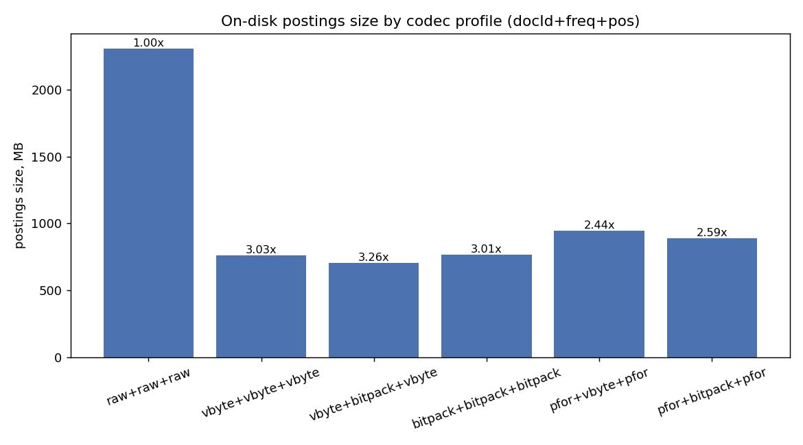
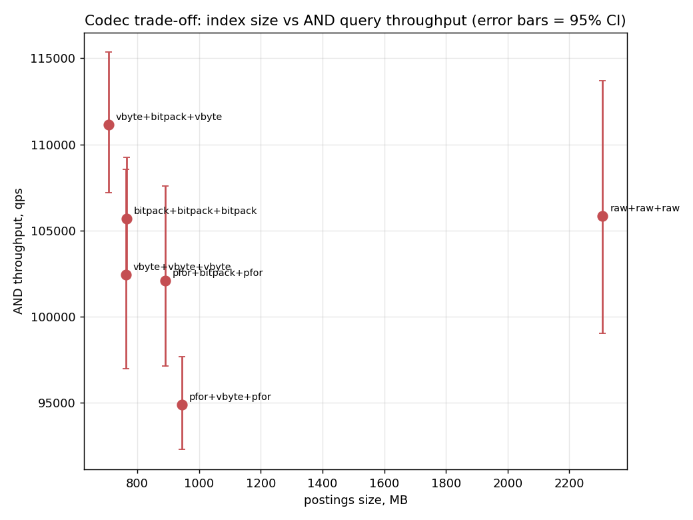

Вывод: `vbyte/bitpack/vbyte` дает лучший размер, потому что docId/positions после delta становятся маленькими числами и хорошо ложатся в VarByte, а `freq` почти всегда мал и плотно пакуется bitpack. 

`vbyte/bitpack/vbyte` также входит в верхнюю группу по `AND`: маленькие docId/position gaps быстро читаются VarByte, а `freq` плотно и регулярно читается bitpack. 

Raw иногда конкурентен по скорости, но его размер больше более чем в 3 раза, поэтому как рабочая конфигурация он невыгоден.

`PForDelta` здесь не выигрывает по размеру: исключений получается достаточно много, и их служебные
байты съедают пользу от меньшей ширины обычных значений. 

После стабилизации замера `vbyte/bitpack/vbyte` выглядит лучшей практической точкой: он минимален по размеру и при этом лучший по среднему `AND qps` в этом прогоне. 

Поэтому стенд, backend/block-size sweep и профили дальше используют именно эту конфигурацию.

## Размер блока и skip-list

| blockSize | postings, MB | AND ms ± 95% CI | AND qps ± 95% CI |
|---:|---:|---:|---:|
| 16 | 712.8 | 8.088 ± 0.345 | 19 784 ± 847 |
| 32 | 707.3 | 4.601 ± 0.051 | 34 772 ± 389 |
| 64 | 705.7 | 2.346 ± 0.071 | 68 196 ± 2 062 |
| 128 | 707.3 | **1.485 ± 0.075** | **107 774 ± 5 481** |
| 256 | 710.9 | 1.551 ± 0.164 | 103 167 ± 11 001 |
| 512 | 715.5 | 1.603 ± 0.052 | 99 832 ± 3 227 |

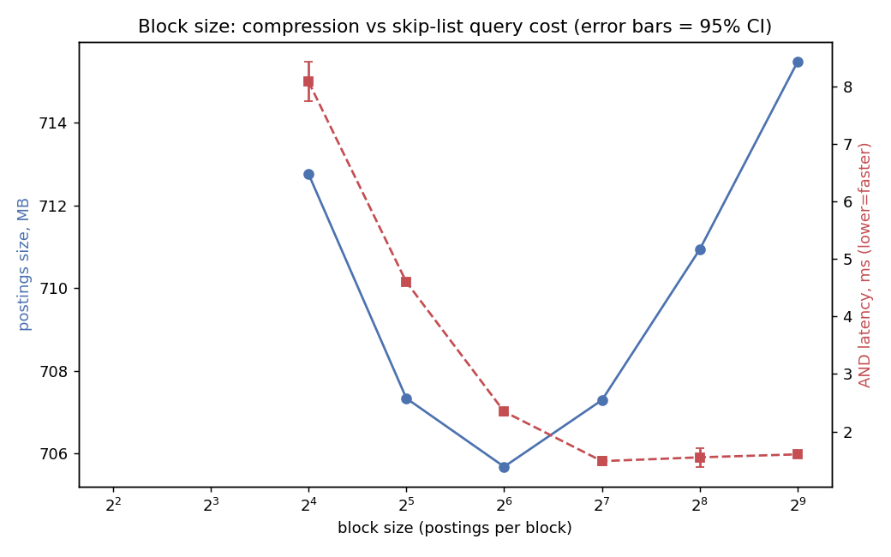

Расхождение линий около `2^7 = 128` объясняется тем, что размер и скорость начинают зависеть от разных причин. 

Размер почти перестает уменьшаться: служебная skip-таблица уже размазана по достаточно крупным блокам. 
На выбранном `vbyte/bitpack/vbyte` оптимальная точка для `AND` в этом прогоне — `blockSize=128`: меньшие блоки дают слишком много служебной навигации, а большие начинают читать больше лишних docId внутри блока.

Поэтому демонстрационная конфигурация оставляет `blockSize=128`; это также осторожный баланс для позиционных `ADJ/NEAR`, где слишком крупный блок может поднимать больше лишних позиций.

## Backend: память vs mmap

Сравнение идет на одинаковом workload-е и одном сжатии `vbyte/bitpack/vbyte`, `blockSize=128`.

`memory` — распакованный `MemoryIndex`; `mmap-*` — on-disk индекс, где меняется размер mmap-сегмента: 128, 512 и 1024 MiB.

| backend | AND ms ± 95% CI | OR ms ± 95% CI | ADJ ms ± 95% CI | NEAR ms ± 95% CI | BM25 ms ± 95% CI |
|---|---:|---:|---:|---:|---:|
| `memory` | **0.380 ± 0.009** | **694 ± 4** | **422 ± 2** | **486 ± 3** | **407 ± 7** |
| `mmap-128m` | 1.571 ± 0.056 | 1257 ± 7 | 1724 ± 20 | **1858 ± 11** | 474 ± 3 |
| `mmap-512m` | **1.546 ± 0.075** | **1221 ± 6** | **1670 ± 2** | 1901 ± 75 | **470 ± 1** |
| `mmap-1024m` | 1.662 ± 0.082 | 1222 ± 38 | 1722 ± 26 | 1866 ± 28 | 472 ± 5 |

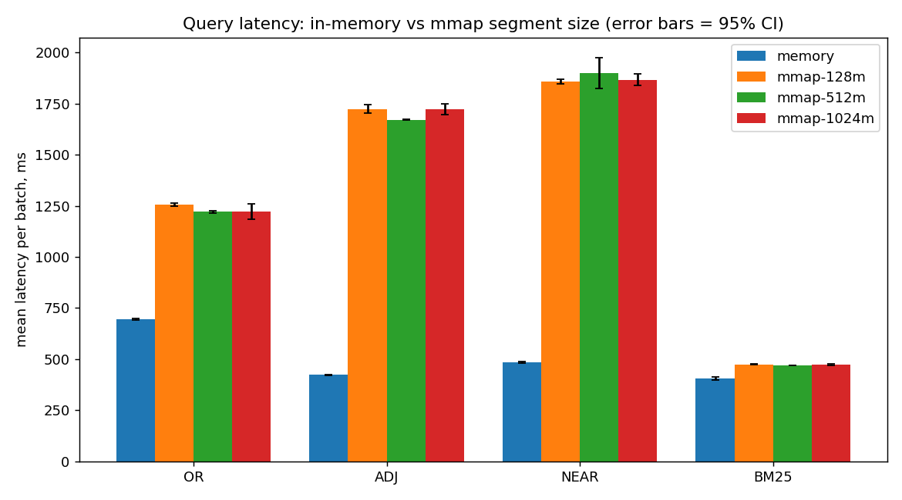

На общем графике `AND` почти не виден рядом с тяжелыми `OR/ADJ/NEAR`, поэтому он вынесен отдельно.

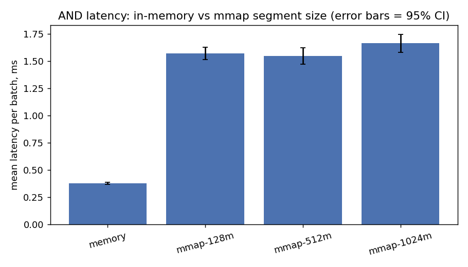

Вывод: `memory` быстрее, потому что posting list-ы уже лежат распакованными массивами. `mmap` платит за чтение отображенных страниц и распаковку блоков, особенно на `ADJ/NEAR`, где нужны позиции.

Размеры mmap-сегмента меняют результат умеренно. 
В этом прогоне 512 MiB выглядит наиболее ровной точкой для `vbyte/bitpack/vbyte`, но разница между mmap-конфигурациями намного меньше разрыва между memory и mmap. 

На позиционных запросах основная цена не в размере сегмента, а в декоде позиций.

## Recall / QPS: WAND

| Режим | recall@10 | ms ± 95% CI | qps ± 95% CI |
|---|---:|---:|---:|
| exhaustive | 1.000 | 386.4 ± 1.7 | 414 ± 2 |
| WAND `F=1.00` | 1.000 | 410.3 ± 1.9 | 390 ± 2 |
| WAND `F=1.02` | 0.943 | 369.5 ± 0.5 | 433 ± 1 |
| WAND `F=1.05` | 0.709 | 197.7 ± 0.9 | 809 ± 4 |
| WAND `F=1.10` | 0.473 | 68.7 ± 1.6 | 2 330 ± 55 |
| WAND `F=1.20` | 0.381 | 10.4 ± 0.2 | 15 420 ± 235 |
| WAND `F=1.40` | 0.376 | 2.4 ± 0.0 | 66 578 ± 408 |
| WAND `F=1.70` | 0.375 | 1.0 ± 0.0 | 155 779 ± 3 138 |
| WAND `F=2.00` | 0.375 | 0.7 ± 0.0 | 219 152 ± 833 |
| WAND `F=3.00` | 0.375 | 0.5 ± 0.0 | 348 799 ± 1 073 |

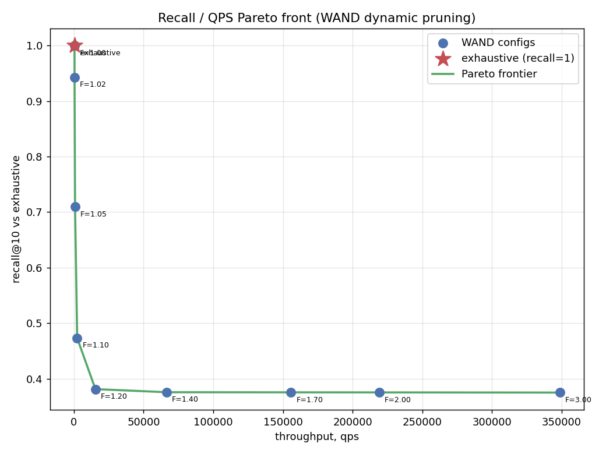
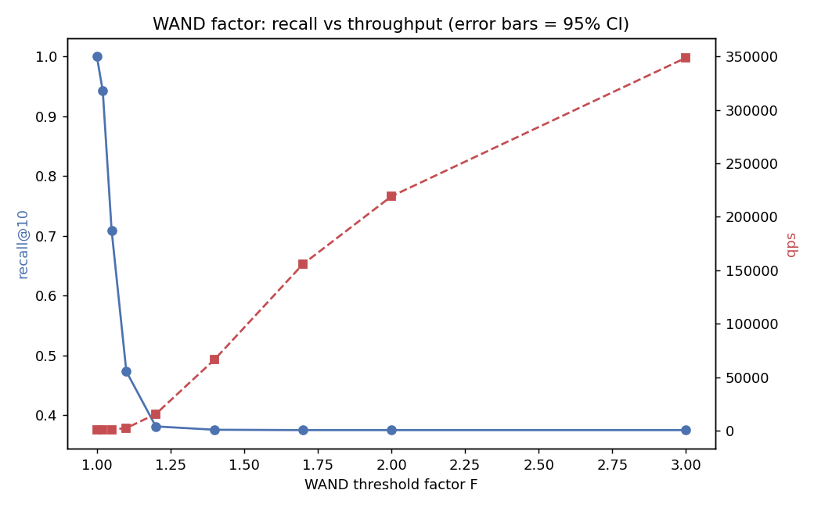

`F=1.0` точен, но не быстрее exhaustive на этом корпусе: верхние границы BM25 слишком слабые, отсечь почти нечего. 
При росте `F` QPS резко растет, но recall быстро падает. Поэтому демонстрационный стенд по умолчанию держит полный recall.

## Профили async-profiler

Профили сняты на выбранной сбалансированной конфигурации: `vbyte/bitpack/vbyte`, `blockSize=128`,
`MAXDOCS=500000`.
Build и query-операции профилируются отдельными JVM-запусками. CPU и allocation тоже снимаются отдельно, чтобы memory-инструментация не искажала CPU-картину.

### Build

**Build CPU** — процессорное время при построении индекса: токенизация, накопление
posting-ов, сжатие блоков и запись файлов. Оригинал: [HTML](profiles/build-balanced-cpu.html).

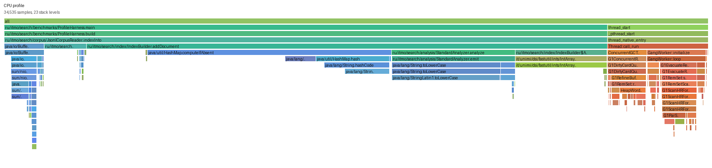

**Build allocation** — создание объекты и массивы при построении индекса. Оригинал:
[HTML](profiles/build-balanced-alloc.html).

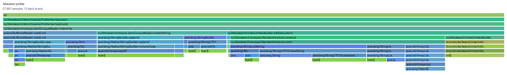

Build-профиль в основном отражает токенизацию, накопление posting-ов, сортированный обход словаря, сжатие блоков и запись `postings.bin`.

### Query operations

Каждый профиль ниже снят отдельным потоком запросов: 

`AND` содержит только `AND`, `OR` только `OR`, `ADJ` только точную близость `ADJ/1`, `NEAR` только оконную близость, `BM25` только ранжирование.

| Операция | CPU HTML | Alloc HTML |
|---|---|---|
| AND | [cpu](profiles/query-balanced-and-cpu.html) | [alloc](profiles/query-balanced-and-alloc.html) |
| OR | [cpu](profiles/query-balanced-or-cpu.html) | [alloc](profiles/query-balanced-or-alloc.html) |
| ADJ | [cpu](profiles/query-balanced-adj-cpu.html) | [alloc](profiles/query-balanced-adj-alloc.html) |
| NEAR | [cpu](profiles/query-balanced-near-cpu.html) | [alloc](profiles/query-balanced-near-alloc.html) |
| BM25 | [cpu](profiles/query-balanced-bm25-cpu.html) | [alloc](profiles/query-balanced-bm25-alloc.html) |

**AND CPU** — короткие пересечения, основное: `advance` и чтение docId/freq-блоков.
Оригинал: [HTML](profiles/query-balanced-and-cpu.html).

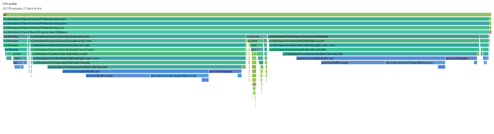

**AND allocation** — показывает, что запросы `AND` почти не должны создавать крупные промежуточные
структуры. Оригинал: [HTML](profiles/query-balanced-and-alloc.html).

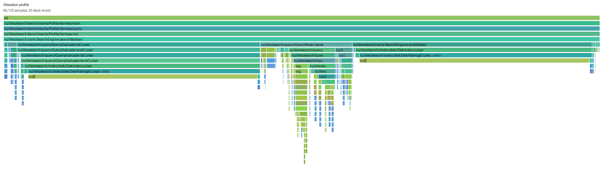

**OR CPU** — полный проход по объединению списков, поэтому скипать получается меньше. Оригинал:
[HTML](profiles/query-balanced-or-cpu.html).

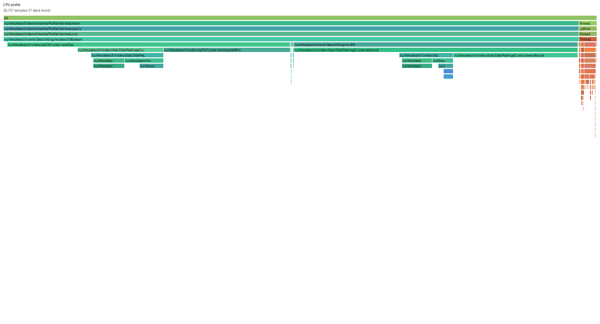

**OR allocation** — полезен для проверки, что объединение не материализует весь результат заранее.
Оригинал: [HTML](profiles/query-balanced-or-alloc.html).

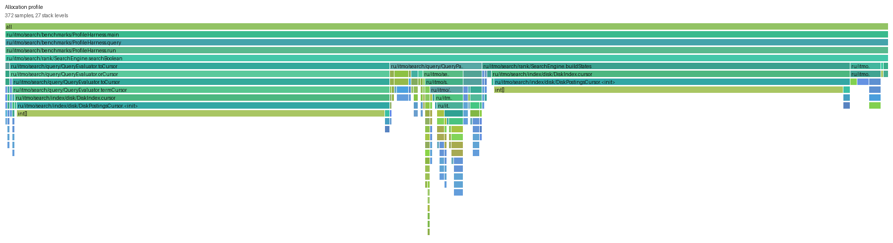

**ADJ CPU** — точная близость: декодируются позиции и проверяется соседство двумя указателями.
Оригинал: [HTML](profiles/query-balanced-adj-cpu.html).

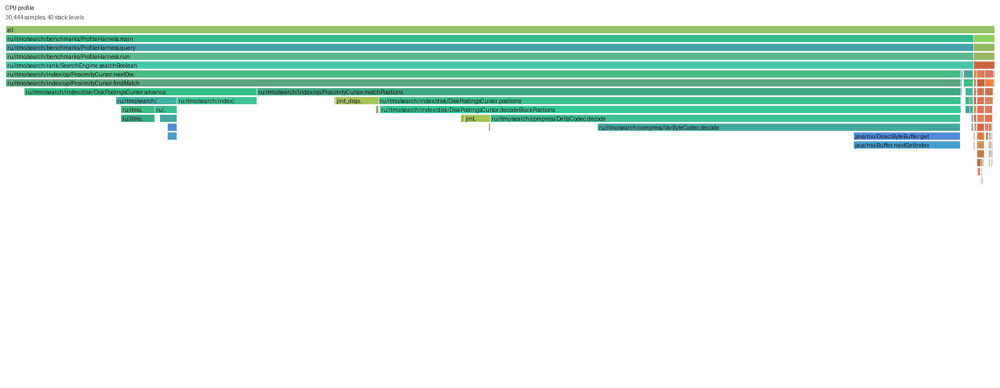

**ADJ allocation** — видны временные буферы позиций только для текущего документа. Оригинал:
[HTML](profiles/query-balanced-adj-alloc.html).

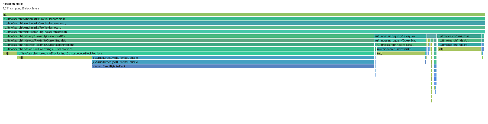

**NEAR CPU** — похож на `ADJ`, но окно шире и сравнение координат допускает оба порядка. Оригинал:
[HTML](profiles/query-balanced-near-cpu.html).

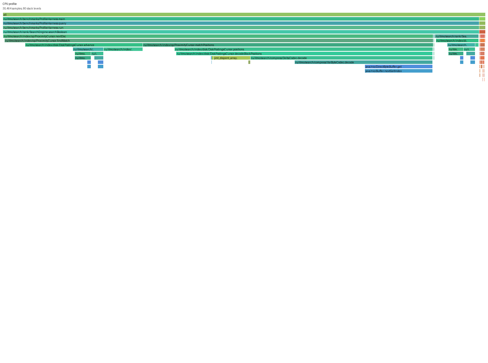

**NEAR allocation** — показывает цену позиционных буферов при оконной близости. Оригинал:
[HTML](profiles/query-balanced-near-alloc.html).

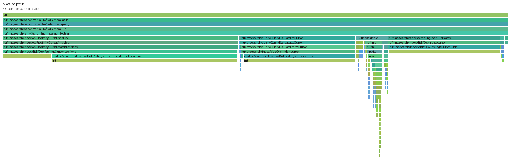

**BM25 CPU** — ранжирование: чтение частот и длин документов, расчет score и WAND-логика. Оригинал:
[HTML](profiles/query-balanced-bm25-cpu.html).

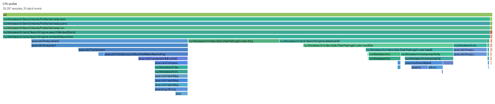

**BM25 allocation** — контроль временных объектов при скоринге. Оригинал:
[HTML](profiles/query-balanced-bm25-alloc.html).

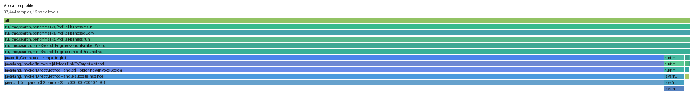

Основная интерпретация совпадает с benchmark-ами: `AND` легкий из-за skip/advance, `OR` обязан
сканировать большие списки, `ADJ/NEAR` становятся более тяжелыми из-за позиций.

## Итоговая конфигурация

Для демонстрации используется:

```text
./run.sh balanced
docId/freq/pos = vbyte/bitpack/vbyte
blockSize = 128
ranking = WAND F=1.0
```

Для точного exhaustive BM25 на той же конфигурации:

```text
./run.sh max-recall
docId/freq/pos = vbyte/bitpack/vbyte
blockSize = 128
ranking = exhaustive
```